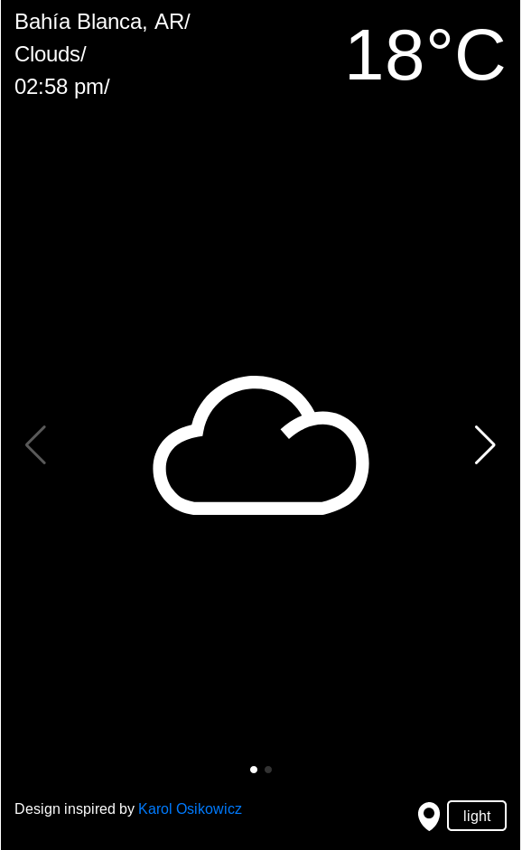
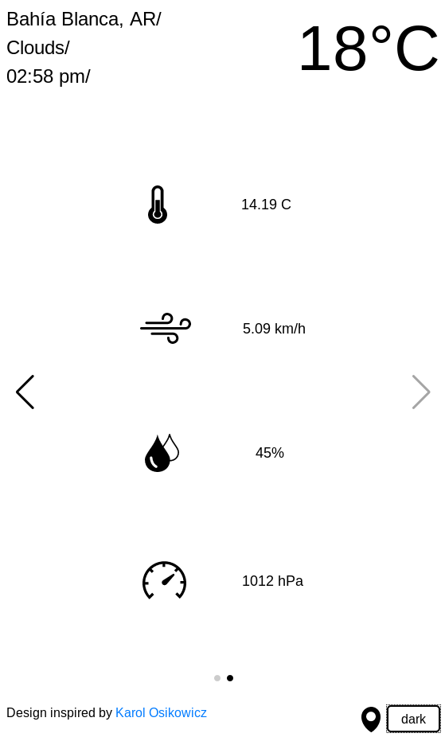

# Weather App
  An HTML/JS web application that displays information about the weather in a given location. It retrieves weather and geolocation data from specific web APIs and renders the result in a minimalistic app design.

   
  ## Live version
  - [Live version](https://raw.githack.com/ivanid22/weather-app/app/dist/index.html) 
  
  ## Built With
  - JavaScript (ES6)
  - Bootstrap
  - Axios
  - Swiper.js
  - Webpack

  ## Author

  👤 **Ivan Diaz**

  - Github: [@ivanid22](https://github.com/ivanid22)
  - Twitter: [@ivanid22](https://twitter.com/ivanid22)
  - Linkedin: [Ivan Diaz](www.linkedin.com/in/ivanid22)

  ## 🤝 Contributing

   - Contributions, issues and feature requests are welcome!

   - Feel free to check the [issues page](https://github.com/ivanid22/restaurant-page/issues).

  ## Show your support

   - Give a ⭐️ if you like this project!

  ## 📝 License

  This project is [MIT](lic.url) licensed.